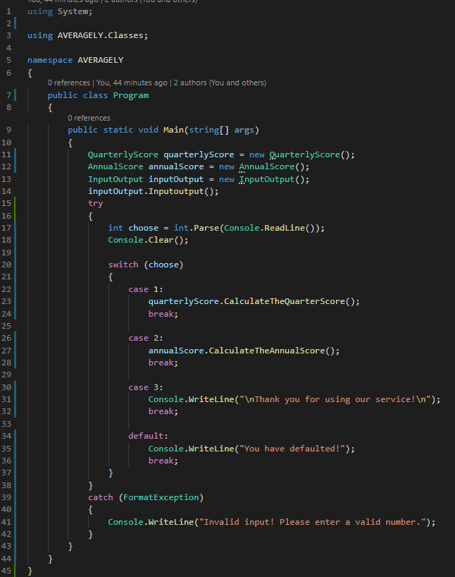
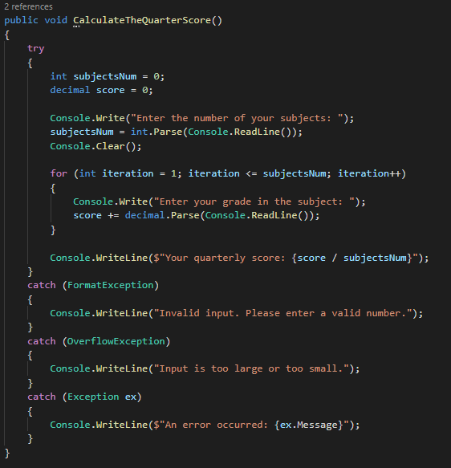
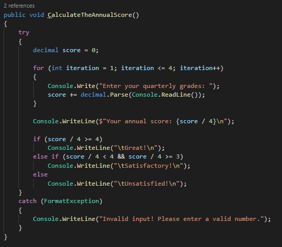

# Averagely.Clone
***
this program helps to calculate the average score of quarterly and annual grades.
it makes the learning processes much easier and more convenient.


***
Here is the code breakdown and how it works:

+ The code starts with the ```AVERAGELY``` namespace, which contains the Program class responsible for running the program.

+ when the program starts you will have 3 choices. They are: ```Quarter grades```, ```Annual Grades``` and ```Exit```.

+ The user's selection is retrieved via ```Console.ReadLine()``` and stored in an input variable.

+ Based on the user's selection, the program uses the switch statement to perform the appropriate action.



***

+ If the user selects the option "Quarter grades" (input value "1"), it calls the ```CalculateTheQuarterScore()``` method from the ```QuarterlyScore``` class.



***

If the user selects the option "Annual Grades" (input value "2"), it calls the ```CalculateTheAnnualScore()``` method from the ```AnnualScore``` class.



***

If the user selects the "Exit" option (input value is "3"), it will prompt the console with "Thank you for using our service!" sends a message and the program ends.


# Result:
